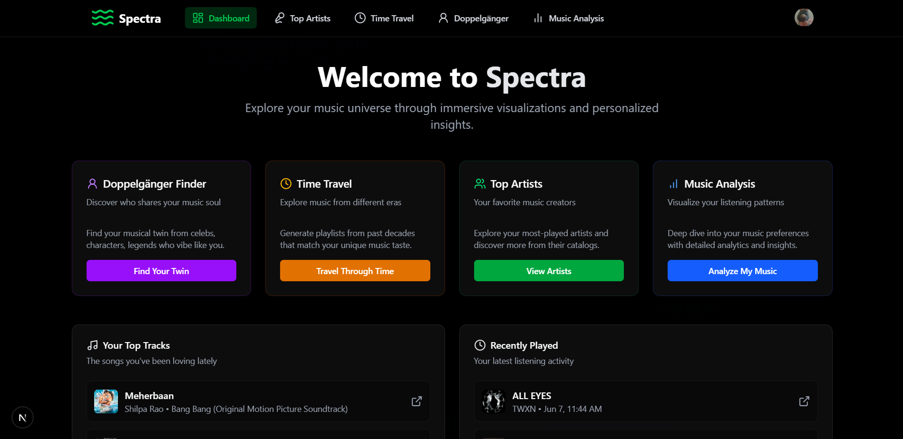

# 🎵 SonicVerse  
**Your Music, Your Universe. Built for Spotify lovers.**

SonicVerse is a Next.js web application that transforms your Spotify music data into a personalized, immersive music exploration experience. With a dark, cosmic-themed interface, SonicVerse enables users to visualize their listening habits, generate era-specific playlists, explore their music identity, and analyze their music preferences.  

Designed for Spotify enthusiasts and casual listeners alike, SonicVerse offers a unique journey through your music universe.  

## ✨ Features  

### 1️⃣ Personalized Dashboard  
Displays your top tracks and recently played songs with album artwork, track names, and artist details.  
- **Why it’s cool:** Provides a snapshot of your music taste, with clickable links to each track on Spotify.  
- **Spotify Compliance:** Includes Spotify logo and links to tracks.  



---

### 2️⃣ Time Travel Playlists  
Generates playlists for specific decades (e.g., 1980s, 2010s) tailored to your music taste, using your top artists’ genres.  
- **Why it’s cool:** Discover how your modern preferences (e.g., rap, Bollywood) would sound in past eras.  
- **Spotify Compliance:** Tracks include Spotify logo and links; saved playlists link to Spotify.  

📸 **Screenshot Placeholder:** Add a screenshot of the time travel feature with a decade selector and playlist.  

---

### 3️⃣ User Profile Integration  
Shows your Spotify profile (display name, avatar) across the app.  
- **Why it’s cool:** Adds a personal touch to your experience.  

📸 **Screenshot Placeholder:** Add a screenshot showing the user’s avatar and name (example: app header).  

---

### 4️⃣ Playlist Saving  
Saves your top tracks or time-travel playlists to your Spotify account.  
- **Why it’s cool:** Take your discoveries with you, listen later, or share with friends.  
- **Feedback:** Toast notifications confirm success or alert you to issues.  

📸 **Screenshot Placeholder:** Add a screenshot of a toast notification or saved playlist confirmation.  

---

### 5️⃣ Top Artists Analysis  
Explore your favorite artists with detailed stats such as genres, popularity, and listening trends.  
- **Why it’s cool:** Dive deeper into the artists shaping your music taste.  

📸 **Screenshot Placeholder:** Add a screenshot of the top artists page showing artist stats or visualizations.  

---

### 6️⃣ Doppelgänger Finder  
Matches your music taste with celebrities, fictional characters, or music legends based on genre or audio features.  
- **Why it’s cool:** Adds a fun, social element to your music experience.  

📸 **Screenshot Placeholder:** Add a screenshot of the doppelgänger feature showing a match result.  

---

### 7️⃣ Music Analysis  
Analyzes your listening patterns, such as track danceability, energy, or mood using Spotify’s audio features.  
- **Why it’s cool:** Offers data-driven insights into your music preferences.  

📸 **Screenshot Placeholder:** Add a screenshot of the music analysis feature showing audio feature insights.  

---

## 🎯 Target Audience  
SonicVerse is built for:  
- **Spotify Enthusiasts**  
- **Nostalgia Seekers**  
- **Casual Listeners**  
- **Tech-Savvy Fans**  

From teens vibing to modern hits to adults revisiting 80s classics — SonicVerse makes music exploration fun and engaging.

---

## 🎵 Spotify Integration  

SonicVerse integrates with the **Spotify Web API** to power its features:

- **Authentication:** OAuth 2.0 (Scopes: `user-read-private`, `user-top-read`, `user-read-recently-played`, `playlist-modify-public`).  
- **Data Access:** User profile, top tracks, top artists, recent plays.  
- **Recommendations:** Era-specific playlists using genres and artist seeds.  
- **Audio Features:** Danceability, energy, mood.  
- **Playlist Management:** Create and populate playlists.  

**Compliance:**  
- Spotify logos and links on tracks/playlists.  
- Requires users to agree to Terms of Use and view Privacy Policy before login (`/terms`, `/privacy`).  

---

## 🛠️ Tech Stack  

| Layer      | Tech |
|------------|------|
| Frontend   | Next.js (React) + TypeScript |
| Styling    | Tailwind CSS |
| UI Library | Shadcn UI + Sonner for Toasts |
| API Calls  | Axios |
| Icons      | Lucide React |
| Backend    | Next.js API Routes |
| Environment| Node.js (v18+) |

---

## 🚀 Getting Started  

### Visit the App  
👉 [Deployed URL](https://sonicverse.vercel.app) *(replace this with your URL)*  

### User Instructions  
1. Visit the app.  
2. Agree to **Terms of Use** and **Privacy Policy**.  
3. Authenticate with **Spotify**.  
4. Explore your music universe! 🎵

### For Developers  

```bash
# Clone the repository
git clone https://github.com/your-username/sonicverse.git

# Navigate into the project directory
cd sonicverse

# Install dependencies
npm install

# Configure environment variables
# Create a .env.local file with the following:
SPOTIFY_CLIENT_ID=your_spotify_client_id
SPOTIFY_CLIENT_SECRET=your_spotify_client_secret
NEXT_PUBLIC_REDIRECT_URI=http://localhost:3000/api/auth/callback

# Start the development server
npm run dev
